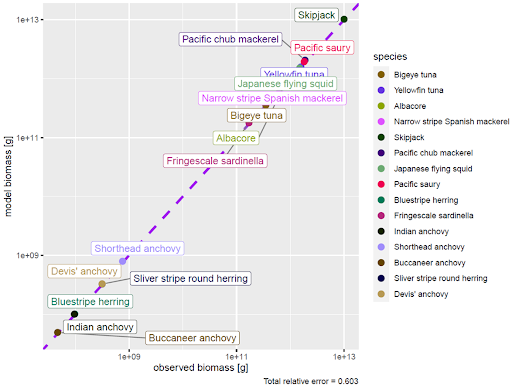
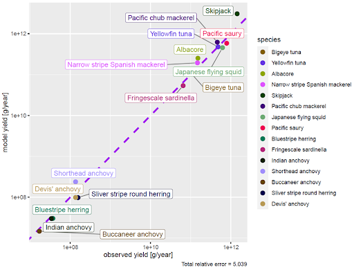

**Model name**

Western Pacific Ocean mizer model

**Contacts**

Yan-Lun, Wu ([yanlun.wu84\@gmail.com](mailto:yanlun.wu84@gmail.com) ) 

**Spatial scale forcing**

Regional (shape files provided, mizer is not spatial so no point subdividing the area)

**Levels of gear disaggregation**

Species-specific gears (taken from functional-group level resolution from Sea Around Us)

**Levels of functional group disaggregation**

Species-specific gears, no functional groups in the Mizer model 

**Spatial grid-cell allocation method**

Summarised across the entire model region

**Fishing mortality rate equation**

Fishing mortality by species and across time fed in directly from Western & Central Pacific Fisheries Commission. Catch rates are computed from assumed biomasses and fishing mortalities.

**Selectivity (size,age,species)**

Selectivity naively assumed to be a function of maturation size for each species.

**Model calibration**

Spawning stock biomass by species taken from Western & Central Pacific Fisheries Commission. Model parameters tuned to match these. 

**Catchability and Creep (yearly rate of change catchability) Estimates**

$$Please provide details on the specific estimated parameters from the calibration, e.g. range of creep of 2-5% per year; and catchability coefficients per gear / functional group as necessary$$

N/A\
**Further details on calibration**

Further calibration planned with historical catches and species trends over time using expert opinion.

**Statistical metrics**

Statistical parameter estimation to fit the emergent abundance patterns of dynamic size spectrum models to data is an area of current and future methodological development and could be carried out through the use of optimization (Blanchard et al. 2014), maximum likelihood or Bayesian inference algorithms.

Blanchard, J. L., Andersen, K. H., Scott, F., Hintzen, N. T., Piet, G., & Jennings, S. (2014). Evaluating targets and trade‐offs among fisheries and conservation objectives using a multispecies size spectrum model. Journal of Applied Ecology, 51(3), 612-622.

**Statistical results (summary)**

**-Biomass calibration**

**-Yield Calibration**

**Model changes or  improvements(s) made as a result of calibration**\
**ADDITIONAL DETAILS FOR REGIONAL MODELS ONLY:**

**Downscaling method**

N/A

**The "base" year range of the regional model**

N/A
